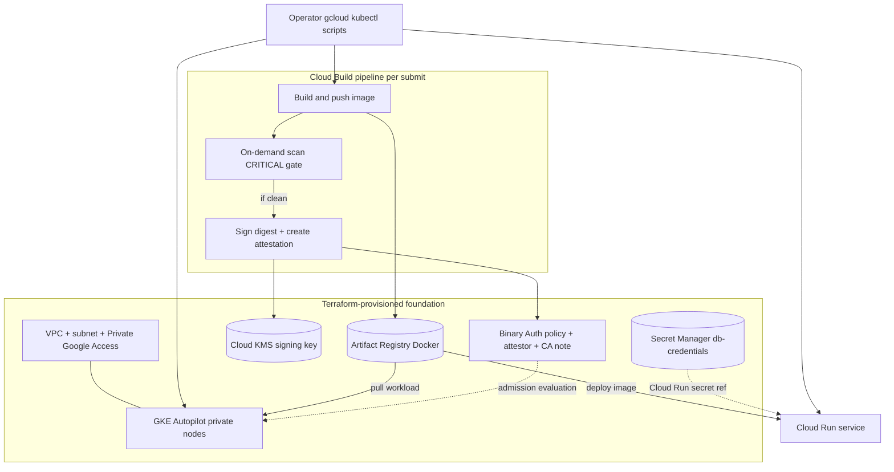
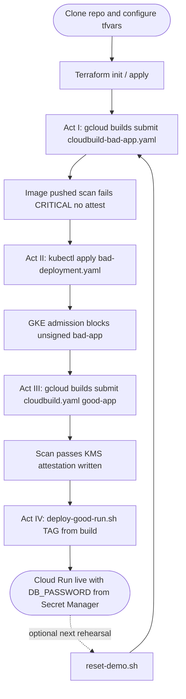

# Trusted supply chain demo (GCP)

## Prerequisites and Setup

Use this checklist before running Terraform, Cloud Build, or the helper scripts in your own GCP project.

1. **Clone** the repository and enter the directory.
   ```bash
   git clone https://github.com/<YOUR_ORG>/<YOUR_REPO>.git
   cd <YOUR_REPO>
   ```
2. **Configure Terraform:** Copy the example variables file and fill in your project and region (and optional naming overrides if you change defaults).
   ```bash
   cp terraform.tfvars.example terraform.tfvars
   ```
   Edit `terraform.tfvars`: set `project_id` to **`<YOUR_PROJECT_ID>`** and `region` to **`<YOUR_REGION>`** (for example `us-central1`). Keep **`artifact_repository_id`**, **`gke_cluster_name`**, and related names aligned with **Cloud Build substitutions** in `cloudbuild.yaml` (see `terraform output cloud_build_substitutions_hint` after apply).
3. **Authenticate** the Google Cloud CLI and Application Default Credentials (used by Terraform and many `gcloud` flows):
   ```bash
   gcloud auth login
   gcloud auth application-default login
   gcloud config set project <YOUR_PROJECT_ID>
   ```
4. **Scripts that talk to GCP** (`deploy-good-run.sh`, `reset-demo.sh`) require **`PROJECT_ID`**, **`REGION`**, and (for deploy) **`TAG`**. Export them in your shell, or copy **`.env.example`** to **`.env`**, edit the values, then run:
   ```bash
   set -a && source .env && set +a
   ./deploy-good-run.sh
   ```
   Never commit `.env` or `terraform.tfvars`; both are gitignored.

---

End-to-end demo: **Terraform** provisions Artifact Registry, **KMS** signing, **Container Analysis** note, **Binary Authorization** attestor and **enforce policy**, **Secret Manager** (`db-credentials`), and **GKE Autopilot** (default cluster name **`demo-cluster`**; override with `gke_cluster_name` in `terraform.tfvars`). Sample **bad-app** vs **good-app** Node services illustrate secrets, dependencies, and container baseline. **Cloud Build** (`cloudbuild.yaml`) builds, pushes, **on-demand scans** with a **CRITICAL gate**, then **attests** the image digest. **GKE** and **Cloud Run** steps show deny vs allow paths.

## Architecture

- **Infra:** APIs (including **On-Demand Scanning** for `gcloud artifacts docker images scan`), `secure-supply-chain-repo` (Docker), KMS key ring + asymmetric signing key, attestation note + attestor, BinAuthz **project policy** (require attestation; GKE system images whitelisted), secret `db-credentials`, **VPC + regional subnet** (secondary ranges for pods/services), **GKE Autopilot with private nodes** (works when org policy blocks VM external IPs), BinAuthz evaluation on the cluster.
- **CI:** Docker build → push → `gcloud artifacts docker images scan` → fail on CRITICAL → `gcloud beta container binauthz attestations sign-and-create`.
- **Runtime:** Unsigned `bad-app` → `bad-deployment.yaml` on GKE (expect block). `good-app` → `deploy-good-run.sh` on Cloud Run with `DB_PASSWORD` from Secret Manager.

### Architecture diagram (components & trust flow)

High-level view of what **Terraform** leaves in the project, how **Cloud Build** feeds **Artifact Registry** and **Binary Authorization**, and how **GKE** vs **Cloud Run** consume images and secrets. Arrows are logical data or policy flow, not every GCP API call.



### PoC execution flow (order of operations)

Typical path from empty project through the **four-act** story. **Optional:** run **`reset-demo.sh`** between rehearsals to clear GKE Deployment, Cloud Run service, and Artifact Registry packages without destroying Terraform.



## Repository layout

| Path | Purpose |
|------|---------|
| `main.tf`, `variables.tf`, `outputs.tf` | Terraform root module |
| `terraform.tfvars.example` | Copy to `terraform.tfvars` (gitignored) |
| `bad-app/` | Intentionally weak Express app + Dockerfile |
| `good-app/` | Hardened Express app + Dockerfile |
| `cloudbuild.yaml` | Build / push / scan / attest (default: `good-app`) |
| `cloudbuild-bad-app.yaml` | Same pipeline for **`bad-app`** (Act I / failed scan gate) |
| `bad-deployment.yaml` | GKE Deployment manifest (replace image placeholder) |
| `deploy-good-run.sh` | Cloud Run deploy with `--set-secrets` |
| `reset-demo.sh` | Day-of reset: GKE Deployment, Cloud Run service, AR images (not Terraform) |
| `destroy-demo-infra.sh` | **`terraform destroy`** with strong confirmations (full teardown) |
| `generate-lockfiles.sh` | Creates `package-lock.json` in both apps (needs **npm** or **Docker**) |

## Tools and billing

- GCP project with billing enabled and IAM sufficient for this module (see **IAM permissions** below).
- **Tools:** `terraform` (>= 1.5), `gcloud`, `kubectl`, Docker (optional for local image builds if you use Cloud Build only).
- **Auth:** Complete **Prerequisites and Setup** (`gcloud auth application-default login`, or a service account key for automation).

## Terraform

```bash
cp terraform.tfvars.example terraform.tfvars   # set project_id / region
terraform init
terraform plan
terraform apply
```

**Outputs** include Artifact Registry URL prefix, KMS names, attestor id, cluster name, a **`cloud_build_substitutions_hint`** map, and the **Compute default** / **Cloud Build** service account emails when IAM is enabled.

**Cloud Build IAM (Terraform):** With **`grant_cloud_build_iam = true`** (default), Terraform grants:

- **`PROJECT_NUMBER-compute@developer.gserviceaccount.com`:** project roles for source/worker operations (storage object admin, Artifact Registry writer, logging, on-demand scanning admin, Cloud KMS viewer, Binary Authorization viewers, Container Analysis notes + occurrences editors), plus **KMS key** roles `roles/cloudkms.signer` and `roles/cloudkms.publicKeyViewer`, and **`secretAccessor`** on `db-credentials` (typical default for Cloud Run `--set-secrets`).
- **`PROJECT_NUMBER@cloudbuild.gserviceaccount.com`:** `roles/storage.admin` so `gcloud builds submit` can use the Cloud Build source bucket.

Set **`grant_cloud_build_iam = false`** in `terraform.tfvars` if your org applies these bindings via a central pipeline or denies project-level IAM edits.

**Note:** `terraform.tfvars` is listed in `.gitignore`; keep secrets out of git.

## Binary Authorization policy

The default admission rule **requires** attestation by the Terraform-created attestor. **Whitelist patterns** cover common GKE system image registries so Autopilot can still pull infrastructure images. **User images** from Artifact Registry must be **attested** by your pipeline (or manual `sign-and-create`) before GKE admission succeeds.

## Cloud Build

1. Connect repository (GitHub/CSR) or run `gcloud builds submit --config=cloudbuild.yaml .` from this directory.
2. **IAM:** If `grant_cloud_build_iam` is **true**, Terraform applies the roles described in the Terraform section above. If you use a **custom build service account** in a trigger, mirror those roles onto that SA instead.
3. Align **substitutions** in `cloudbuild.yaml` (or the trigger) with Terraform outputs (`_KEY_VERSION` may be `1` initially).

**bad-app contrast:** use [`cloudbuild-bad-app.yaml`](cloudbuild-bad-app.yaml) so you do not edit the main config:

```bash
gcloud builds submit --config=cloudbuild-bad-app.yaml --project=<YOUR_PROJECT_ID> .
```

## Lockfiles (reproducible `npm ci` in Docker)

Run once on a machine with **Node/npm** or **Docker**:

```bash
chmod +x generate-lockfiles.sh
./generate-lockfiles.sh
```

This writes `package-lock.json` under `bad-app/` and `good-app/`. Commit them if you want identical dependency trees across machines and CI.

## Day-of reset and infra teardown

### `reset-demo.sh` (rehearsals — runtime artifacts only)

Clears **GKE** `Deployment/bad-app`, **Cloud Run** `trusted-good-app` (configurable), and **all Docker packages** in **`secure-supply-chain-repo`**. Does **not** delete the cluster, KMS, or Terraform resources.

```bash
chmod +x reset-demo.sh
export PROJECT_ID="<YOUR_PROJECT_ID>"
export REGION="<YOUR_REGION>"
# Optional: REPO_NAME, CLOUD_RUN_SERVICE, K8S_DEPLOYMENT, GKE_CLUSTER (defaults match terraform.tfvars)
./reset-demo.sh
```

You will see a **WARNING** prompt first (`y` to continue). The script prints **red** lines for destructive steps and a **green** **Stage Ready** message when finished.

**Note:** The manifest uses **`metadata.name: bad-app`**, so the default Kubernetes resource is **`deployment/bad-app`**, not `bad-app-deployment`. Override with **`K8S_DEPLOYMENT`** if you rename it.

### `destroy-demo-infra.sh` (full project teardown)

Runs **`terraform destroy -auto-approve`** from this directory after **two** confirmations (you must type **`DESTROY`** then **`y`**). Use when you want to remove **all** Terraform-managed resources (GKE, VPC, AR repo, KMS, BinAuthz policy, IAM bindings from this module, etc.).

```bash
chmod +x destroy-demo-infra.sh
./destroy-demo-infra.sh
```

## GKE (unsigned bad-app)

```bash
gcloud container clusters get-credentials <YOUR_CLUSTER_NAME> \
  --region <YOUR_REGION> \
  --project <YOUR_PROJECT_ID>
# Edit bad-deployment.yaml image line, then:
kubectl apply -f bad-deployment.yaml
```

Expect **admission denial** if the image is **unsigned** under the current policy.

## Cloud Run (good-app)

1. Build and push an **attested** `good-app` image (recommended: Cloud Build pipeline).
2. Set **`PROJECT_ID`**, **`REGION`**, and **`TAG`** (image tag or Cloud Build `BUILD_ID`) in the environment or in `.env` (see **Prerequisites and Setup**).
3. Ensure the **Cloud Run runtime service account** has **`roles/secretmanager.secretAccessor`** on `db-credentials` (included when `grant_cloud_build_iam` is true for the default Compute SA).
4. Run:

```bash
chmod +x deploy-good-run.sh
export PROJECT_ID="<YOUR_PROJECT_ID>"
export REGION="<YOUR_REGION>"
export TAG="<YOUR_BUILD_ID_OR_TAG>"
./deploy-good-run.sh
```

If your org enforces **Binary Authorization for Cloud Run**, the image must satisfy that policy as well.

---

## How to Demo this PoC (Keynote Playbook)

Use this section as a **stage script**. Substitute **`<YOUR_PROJECT_ID>`**, **`<YOUR_REGION>`**, and **`<YOUR_CLUSTER_NAME>`** (and Artifact Registry paths) everywhere below. Complete **Terraform apply** and confirm **`grant_cloud_build_iam`** is enabled before the live demo.

---

### Act I: The Rush Job (Triggering the Feedback Loop)

**Premise:** A team ships **`bad-app`** under pressure—outdated dependencies and a “just merge it” mindset. The pipeline is the first place the organization **pushes back**, before a bad image ever becomes “trusted.”

#### Run the pipeline for `bad-app`

Use the dedicated config **[`cloudbuild-bad-app.yaml`](cloudbuild-bad-app.yaml)** (same stages as `cloudbuild.yaml`, but **`bad-app`** image and Dockerfile). You do **not** need to edit `cloudbuild.yaml`.

#### Git commands (commit the vulnerable app + bad pipeline config)

```bash
cd /path/to/usecase-sec-app-sf

git checkout -b demo/act-i-bad-app
git add bad-app/ cloudbuild-bad-app.yaml
git commit -m "demo: Act I — bad-app pipeline (expect CRITICAL scan failure)"
git push origin demo/act-i-bad-app
```

Configure your trigger to use **`cloudbuild-bad-app.yaml`**, or submit manually:

```bash
gcloud config set project <YOUR_PROJECT_ID>
gcloud builds submit --config=cloudbuild-bad-app.yaml --project=<YOUR_PROJECT_ID> .
```

#### What to show in the GCP Console (visual outcome)

1. Open **Google Cloud Console** → **Cloud Build** → **History** (or **Dashboard**).
2. Select the **latest build**. Walk the audience through the step timeline:
   - **build** and **push** succeed (the image lands in Artifact Registry).
   - **scan_and_gate** turns **red** / **FAILED**—the build **never reaches** **attest**.
3. Open **Cloud Build** → your build → **Step** **scan_and_gate** → **Logs**. Point to lines such as **`Policy gate: N CRITICAL finding(s)`** (wording may vary slightly with scanner data).
4. Optional: **Artifact Registry** → **`secure-supply-chain-repo`** → **`bad-app`**—show that a digest was pushed, but **no attestation** step ran (no “golden path” signature in Act III terms).

#### Talk Track

> “This is the **shift left** moment. We didn’t wait for production—or even for Kubernetes—to discover the problem. **Artifact Analysis** and **on-demand scanning** ran against the **same artifact** we would have deployed. The pipeline encodes policy: **any CRITICAL finding fails the build**, so we **never sign** this image with our **KMS-backed attestor**. Security isn’t a ticket after the fact; it’s **feedback in the same PR cycle** the developer already cares about.”

---

### Act II: The Rogue Bypass (Enforcing the Perimeter)

**Premise:** Someone tries to **skip CI** and **kubectl apply** a container straight to the cluster. **IAM alone** does not make the workload **trusted**—**Binary Authorization** enforces **cryptographic policy** at admission.

#### Prep the manifest image line

Edit [`bad-deployment.yaml`](bad-deployment.yaml): replace the placeholder **`image:`** with the **unsigned** `bad-app` image you pushed in Act I (use **tag or digest** from Artifact Registry), for example:

`<YOUR_REGION>-docker.pkg.dev/<YOUR_PROJECT_ID>/secure-supply-chain-repo/bad-app:BUILD_ID`

#### Exact command

```bash
gcloud container clusters get-credentials <YOUR_CLUSTER_NAME> \
  --region <YOUR_REGION> \
  --project <YOUR_PROJECT_ID>

kubectl apply -f bad-deployment.yaml
```

#### Expected output (representative)

Admission may **reject** the workload; you might see **`Error from server (Forbidden)`** or a **Webhook** / **ValidatingAdmissionPolicy** style message. Example shapes (exact text can vary by cluster version and policy):

```text
Error from server (Forbidden): error when creating "bad-deployment.yaml":
admission webhook "binaryauthorization.googleapis.com" denied the request:
...no attestations found... or ...image is not attested...
```

If the object is **created** but pods never become **Ready**, show **`kubectl describe pod`** / **Events** for **FailedCreate** or **denied** messages tied to **Binary Authorization**.

#### What to show in the GCP Console

1. **Kubernetes Engine** → **Workloads** (optional: show **no healthy Deployment** or **failed** state).
2. **Binary Authorization** → **Policy** / **Violations** (if enabled in your project UI)—tie the denial to **policy require attestations**.
3. Emphasize: the identity running **`kubectl`** might be **powerful**, but **the control plane** still **refuses** the image without a valid **attestation**.

#### Talk Track

> “Even with **broad IAM**, an attacker or a rushed operator could push an image and try to run it. **That’s not the trust model we want.** **Binary Authorization** ties **admission** to **evidence**: this cluster expects an image **signed by our pipeline’s attestor**. **Unsigned** `bad-app` never got an attestation in Act I—so **the perimeter holds**. **Permissions** get you to the API; **policy** decides whether the workload is **allowed**.”

---

### Act III: The Golden Path (The Chain of Trust)

**Premise:** Restore the **healthy** path: **`good-app`** passes the **scan gate**, then the pipeline **signs** the digest—**chain of trust** from build to **attestation**.

#### Run the pipeline for `good-app`

Use the default **[`cloudbuild.yaml`](cloudbuild.yaml)** (already targets **`good-app`**). If Act I used a trigger pointed at `cloudbuild-bad-app.yaml`, switch the trigger back—or always submit manually with the file you need.

#### Git commands

```bash
git checkout main   # or your default branch
git add cloudbuild.yaml good-app/
git commit -m "demo: golden path — good-app + scan + attest"
git push origin main
```

Manual submit:

```bash
gcloud builds submit --config=cloudbuild.yaml --project=<YOUR_PROJECT_ID> .
```

#### What to show in the GCP Console (visual outcome)

1. **Cloud Build** → **History** → open the **succeeded** build.
2. Step order: **build** → **push** → **scan_and_gate** → **attest** — all **green**.
3. **Artifact Registry** → **`secure-supply-chain-repo`** → **`good-app`** → select the **digest** from this build. Show **metadata**: **vulnerabilities** (none CRITICAL / cleaner than `bad-app`) and any **supply chain** / **analysis** panels available in your project’s UI tier.
4. **Verify the attestation (CLI anchor for the story):**

```bash
gcloud container binauthz attestations list \
  --project=<YOUR_PROJECT_ID> \
  --attestor=projects/<YOUR_PROJECT_ID>/attestors/demo-attestor \
  --artifact-url=<YOUR_REGION>-docker.pkg.dev/<YOUR_PROJECT_ID>/secure-supply-chain-repo/good-app@DIGEST
```

Replace **`DIGEST`** with **`sha256:...`** from **Artifact Registry** or the build log (**image digest**). You should see **at least one** attestation **occurrence** referencing that digest.

#### Talk Track

> “Here’s the **contract** we want: **build**, **scan**, then **sign**. The **digest** is immutable—our signature binds **trust to that exact bits**, not a floating tag. **GKE** in this PoC can admit **only** what matches **policy**, and policy demands **this attestor**. That’s the **chain of trust**: not ‘someone ran docker,’ but ‘**our automation proved** the artifact met the bar **and** **KMS** witnessed the approval.’”

---

### Act IV: Secure Runtime & Secret Injection (The Finale)

**Premise:** The **good** image runs on **Cloud Run**, and the **database password** never appears in source or in the deploy script—only **Secret Manager** + **runtime injection**.

#### Set environment variables and deploy

1. From **Act III**, note the **Cloud Build `BUILD_ID`** (or image tag) for **`good-app`**.
2. Export **`PROJECT_ID`**, **`REGION`**, and **`TAG`** (or `source` your `.env` file).
3. Run:

```bash
chmod +x deploy-good-run.sh
export PROJECT_ID="<YOUR_PROJECT_ID>"
export REGION="<YOUR_REGION>"
export TAG="<ACT_III_BUILD_ID_OR_TAG>"
./deploy-good-run.sh
```

#### What to show in the GCP Console

1. **Cloud Run** → **Services** → **`trusted-good-app`** (or your service name).
2. Open the **latest revision** → **Containers**, **Volumes**, **Networking**, **Security** as needed for your narrative.
3. **Variables & secrets** (or **Edit & deploy new revision** → **Variables & secrets**):
   - Show **`DB_PASSWORD`** (or equivalent) listed as a **secret reference** to **`db-credentials`**, **not** a plaintext literal.
4. Explain: the **value** lives in **Secret Manager**; Cloud Run’s **service account** (here, the default **Compute** SA if unchanged) needs **`secretAccessor`**—already granted when **`grant_cloud_build_iam`** is true in Terraform.

#### Invoke the service (org-dependent)

If **public** invoke is blocked, demonstrate with an **identity token**:

```bash
curl -sS -H "Authorization: Bearer $(gcloud auth print-identity-token)" \
  "https://<YOUR_CLOUD_RUN_SERVICE>-<YOUR_PROJECT_NUMBER>.<YOUR_REGION>.run.app/health"
```

Cloud Run URLs use the **project number**, not the project id. Find it with `gcloud projects describe <YOUR_PROJECT_ID> --format='value(projectNumber)'`.

Expect JSON including **`"demo":"good-app"`** and **`"dbConfigured":true`** when the secret is mounted.

#### Talk Track

> “We fixed the **supply chain** in Acts I–III; Act IV is **safe operations**. The app **never** hardcodes the database password—we inject **`DB_PASSWORD`** from **Secret Manager** at **runtime**. The script and the console show **references**, not **secrets**. That’s how we **rotate**, **audit**, and **least-privilege** access without teaching every developer to paste credentials into YAML.”

---

## IAM permissions

Two principals matter: whoever **runs Terraform** (provisions APIs, resources, and optional project IAM), and whoever **runs the PoC** (`gcloud`, `kubectl`, scripts). In a solo workshop these are often the same Google account; split them when infra is deployed by a platform team and the demo is run by someone else.

### Deploying the infrastructure (Terraform)

Terraform must enable services, create GKE/VPC/AR/KMS/Secret Manager/Binary Authorization resources, and—if **`grant_cloud_build_iam = true`**—add **project IAM bindings** for the default **Compute** and **Cloud Build** service accounts.

| Approach | Roles (on `<YOUR_PROJECT_ID>`) | Notes |
|----------|-------------------------------|--------|
| **Simplest for a personal / lab project** | **`roles/owner`** | Covers APIs, all resources, and project IAM. |
| **Common split (no Owner)** | **`roles/editor`** **plus** **`roles/resourcemanager.projectIamAdmin`** | Editor alone **cannot** change project-level IAM; **`projectIamAdmin`** is required so Terraform can grant the Cloud Build / Compute SA roles. |
| **Tighter (custom)** | Pair **`roles/serviceusage.serviceUsageAdmin`** (enable APIs) with resource-specific roles (e.g. GKE Admin, AR Admin, KMS Admin, Secret Manager Admin, Binary Authorization Admin, Compute Network Admin, `resourcemanager.projectIamAdmin` as needed) | More work to maintain; use when your org forbids broad Editor. |

If **`grant_cloud_build_iam = false`**, Terraform skips those IAM bindings; your org must grant the **Compute default** and **Cloud Build** service accounts the same capabilities described in the **Terraform** section above, or builds and attestation steps will fail.

**Automation:** A **service account** used for `terraform apply` in CI needs the same effective permissions (e.g. Owner on the project, or Editor + Project IAM Admin, or a custom role bundle). Use a dedicated SA key or Workload Identity Federation instead of a user account for pipelines.

### Running the PoC (your user after `terraform apply`)

These are **typical** roles on `<YOUR_PROJECT_ID>` for the identity you use with `gcloud auth login` (the same project Terraform targets). Adjust if your org uses narrower custom roles.

| Activity | Suggested role(s) | Why |
|----------|-------------------|-----|
| **`terraform plan` / `apply` / `destroy`** | Same as **Deploying the infrastructure** | You are the Terraform principal. |
| **`gcloud builds submit`** (Cloud Build) | **`roles/cloudbuild.builds.editor`** (often bundled with **Editor**) | Create builds, stream logs; source upload uses project Cloud Build + GCS (the **Cloud Build** SA already has **`roles/storage.admin`** from Terraform when `grant_cloud_build_iam` is true). |
| **`gcloud container clusters get-credentials`**, **`kubectl apply`**, **`kubectl delete`**, **`kubectl describe`** | **`roles/container.developer`** minimum; **`roles/container.admin`** if you hit RBAC or full workload errors on Autopilot | Developer: cluster access and common workload APIs. Admin: broader cluster control for demos and cleanup. |
| **`gcloud container binauthz attestations list`** (and similar read-only BinAuthz) | **`roles/binaryauthorization.policyViewer`** and **`roles/binaryauthorization.attestorsViewer`** (often satisfied by **Viewer** or **Editor**) | Inspect policy and attestations in Act III. |
| **`deploy-good-run.sh`** (`gcloud run deploy`, **`--allow-unauthenticated`**) | **`roles/run.admin`**, or often **Editor** on the project | Deploy and configure Cloud Run; some orgs scope Run separately from Editor. |
| **`reset-demo.sh`** (delete Cloud Run service, delete AR docker packages, `kubectl delete deployment`) | **`roles/run.admin`** (or **Editor**), **`roles/artifactregistry.admin`** (or **Editor**), plus the **GKE** roles above | Destructive cleanup across Run, Artifact Registry, and the cluster. |

**Least-privilege shortcut for a single presenter:** **`roles/editor`** **plus** **`roles/run.admin`** **plus** **`roles/container.admin`** on the demo project covers almost all CLI steps without Owner. You still need **`roles/resourcemanager.projectIamAdmin`** (or Owner) **for the Terraform apply that sets `grant_cloud_build_iam`**.

**Org policy note:** If deploying Cloud Run with **`--allow-unauthenticated`** is blocked, drop that flag and invoke with an identity token (see Act IV). That does not remove the need for **`roles/run.admin`** to deploy.

### Service accounts Terraform configures (reference)

These are **not** your user; they are Google-managed project SAs that Terraform grants roles to when **`grant_cloud_build_iam = true`**:

| Principal | Roles / notes |
|-----------|----------------|
| **`PROJECT_NUMBER@cloudbuild.gserviceaccount.com`** | **`roles/storage.admin`** — staging build source to the Cloud Build bucket. |
| **`PROJECT_NUMBER-compute@developer.gserviceaccount.com`** | Project: **`roles/storage.objectAdmin`**, **`roles/artifactregistry.writer`**, **`roles/logging.logWriter`**, **`roles/ondemandscanning.admin`**, **`roles/cloudkms.viewer`**, **`roles/binaryauthorization.attestorsViewer`**, **`roles/binaryauthorization.policyViewer`**, **`roles/containeranalysis.notes.editor`**, **`roles/containeranalysis.occurrences.editor`**; on the **KMS key**: **`roles/cloudkms.signer`**, **`roles/cloudkms.publicKeyViewer`**; on secret **`db-credentials`**: **`roles/secretmanager.secretAccessor`**. Acts as the default **Cloud Build worker** (and often the **Cloud Run runtime** SA) in this demo. |
| **GKE node / workload identity** | Autopilot nodes pull images as needed; private **Artifact Registry** access is handled by GKE’s identity and network path—no extra manual SA binding is required for the default demo flow. |

**Org policies:** If `constraints/compute.vmExternalIpAccess` is enforced, the Terraform cluster uses **private nodes** + **Private Google Access** on the subnet. If `allUsers` **Run Invoker** is blocked, Cloud Run stays **authenticated-only**—invoke with `curl -H "Authorization: Bearer $(gcloud auth print-identity-token)"`.

## Troubleshooting

- **No default network:** This stack creates `demo-gke-vpc` / `demo-gke-subnet` instead of relying on the legacy default VPC.
- **Org policy `vmExternalIpAccess`:** The cluster uses **private nodes** (`private_cluster_config`) and **Private Google Access** on the subnet so worker VMs do not need external IPs.
- **Terraform API errors:** wait a few minutes after first API enable; re-run `apply`.
- **Attestor algorithm drift:** if `terraform plan` shows `signature_algorithm` churn, align with provider after first apply.
- **Scan script:** `gcloud` JSON shapes change; adjust Python extraction in `cloudbuild.yaml` if scan name resolution fails.
- **Costs:** GKE Autopilot and storage incur charges; `terraform destroy` when finished (cluster has `deletion_protection = false`).

## Security notice

This repository includes **intentionally vulnerable** dependencies in `bad-app` and a **dummy** secret value in Terraform for `db-credentials`. **Do not** use in production or expose to untrusted networks. Rotate or delete demo resources after the workshop.

### Dependabot

[`.github/dependabot.yml`](.github/dependabot.yml) turns off **all** automated npm updates for **`bad-app/`** (demo-only, vulnerable by design). **`good-app/`** gets weekly grouped **npm** bumps; the repo root gets monthly **Terraform** lockfile/provider updates. After merge, re-run **`./generate-lockfiles.sh`** locally if you rely on committed **`package-lock.json`** files for Docker **`npm ci`**. Any **Dependabot alerts** that still reference **`bad-app`** can be dismissed in GitHub (**Security** → **Dependabot**) with a reason such as **“Used in tests”** or **“Risk accepted / demo”**.

## References

- [Binary Authorization](https://cloud.google.com/binary-authorization/docs)
- [On-demand scanning](https://cloud.google.com/artifact-analysis/docs/on-demand-scanning)
- [Cloud Run secrets](https://cloud.google.com/run/docs/configuring/services/secrets)
- [Terraform Google provider](https://registry.terraform.io/providers/hashicorp/google/latest/docs)
